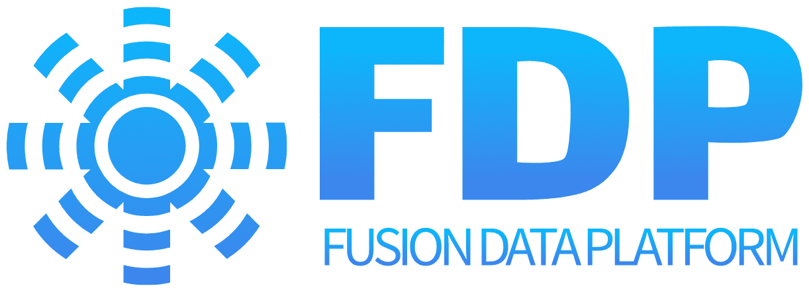
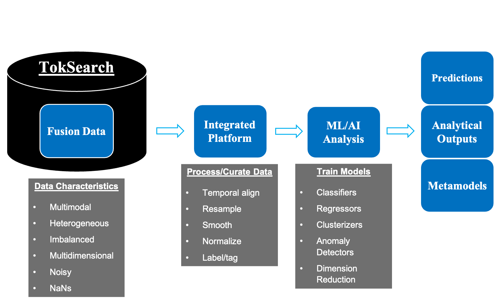
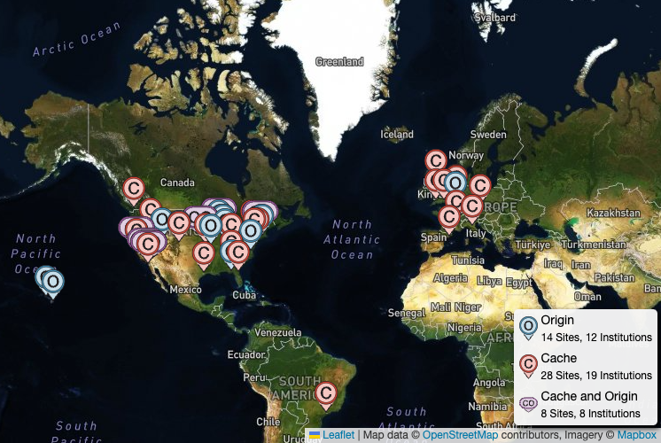
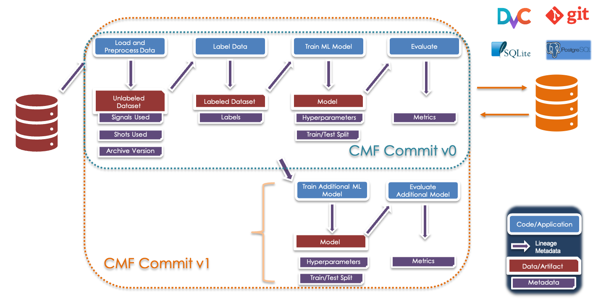

# Welcome to the Fusion Data Platform

The **Fusion Data Platform (FDP)** is a cutting-edge **machine learning and data science platform** designed to support the design and safe operation of a **Fusion Pilot Plant (FPP)**. FDP enables researchers and data scientists to develop high-quality, reproducible AI/ML workflows using fusion data from both experiments and simulations.

FDP allows users to create and search end-to-end AI/ML workflows for fusion data analysis, following the **Common Metadata Framework (CMF)** for reproducibility. **TokSearch** provides indexed access to multimodal fusion data, which is then processed on an integrated platform through alignment, normalization, and labeling. ML/AI models—including classifiers, regressors, clusterizers, and anomaly detectors—analyze the curated data to generate **predictions, analytical outputs, and metamodels**, helping researchers optimize plasma performance and improve fusion device control strategies.

FDP is being developed as a **federated resource**, allowing collective usage of distributed computational facilities and enabling advanced AI/ML modeling techniques to tackle critical fusion science challenges. The platform adheres to **FAIR principles** (Findable, Accessible, Interoperable, and Reusable), ensuring that fusion data and models are easily discoverable and reusable by the scientific community.

## Core Technologies and Tools

FDP is built upon a **modern, federated infrastructure** integrating key tools and technologies for data management, processing, and AI/ML model development. The core technologies include:

### **Open Science Data Federation (OSDF)**

- Provides **distributed data access** across multiple fusion research facilities.
- Enables large-scale data storage and retrieval with **low-latency caching mechanisms**.
- Proven technology from **High Energy Physics (HEP)** and **LIGO**.

📌 [Learn more about OSDF](https://osg-htc.org/services/osdf.html)  

### **Common Metadata Framework (CMF)**

- Implements **integrated distributed version control** for **data, metadata, and code**.
- Ensures full **provenance tracking**, making workflows reproducible and auditable.
- Built by **Hewlett Packard Enterprise (HPE)** to enable **scalable scientific data management**.

📌 [Learn more about CMF](https://hewlettpackard.github.io/cmf/)

### **TokSearch**
- A **high-performance data processing framework** optimized for fusion.
- Provides **parallelized** data retrieval and processing for large-scale AI/ML workflows.
- Developed by **General Atomics** to handle DIII-D data efficiently.

📌 [Learn more about TokSearch](https://ga-fdp.github.io/toksearch/latest/)

### **SapientAI Visual Labeling Tool**
- A **fusion-specific visual labeling interface** designed to assist in semi-supervised learning.
- Allows domain experts to **quickly label large datasets** for AI/ML model training.
- Integrates **automated labeling suggestions** using **semi-supervised learning (SSL)** techniques.
- Supports **time-series, 2D, and 3D fusion diagnostic data**.
- Fully integrated with **TokSearch** for efficient retrieval of fusion data for labeling.

📌 [Learn more about the SapientAI Visual Labeling Tool](#)

## Partners and Collaborators

FDP is a collaboration between leading institutions in fusion energy and computational science:

- **General Atomics (GA)** - Lead institution, providing expertise in **fusion data management** and **AI/ML applications for fusion**.
- **University of California, San Diego (UCSD) and San Diego Supercomuter Center** - Leads **data federation infrastructure** and high-performance computing integration.
- **Hewlett Packard Enterprise (HPE)** - Provides metadata management and workflow tracking via CMF.
- **SapientAI LLC** - Develops **fusion-specific data curation tools** and AI models.

## Demonstration Workflows

To showcase its capabilities, FDP is supporting multiple high-impact demonstrations:

1. **Gyrokinetic Simulation Workflow**
   - Develops **physics-informed AI models** for **plasma turbulence** prediction.
   - Uses **multi-fidelity AI models** to enhance reactor design simulations.

2. **Identification of Safe Operational Regions**
   - Builds **hazard function-based models** to predict and mitigate tokamak instabilities.
   - Integrates experimental data from **DIII-D** and other fusion devices.

3. **Safe and Certifiable Control**
   - Implements **AI-driven real-time control algorithms** to prevent plasma disruptions.
   - Leverages **Lyapunov-based machine learning methods** for certification.

## Get Involved

FDP is actively engaging with the **fusion research community** and welcomes participation from researchers, engineers, and AI/ML specialists.

- 📌 **Join our early adopter program** to help shape FDP's development.
- 📌 **Contribute workflows and datasets** to expand the fusion AI/ML ecosystem.
- 📌 **Collaborate on AI-driven fusion research** using FDP’s scalable tools.

📌 [Sign up for support](https://forms.gle/n7oCj2Kj4gFPADmZ9) 

📌 The main data that FDP currently provides efficient access to is DIII-D data.  If you are not yet a DIII-D User, you will need to follow the steps [here.](https://d3dfusion.org/become-a-user/) 

